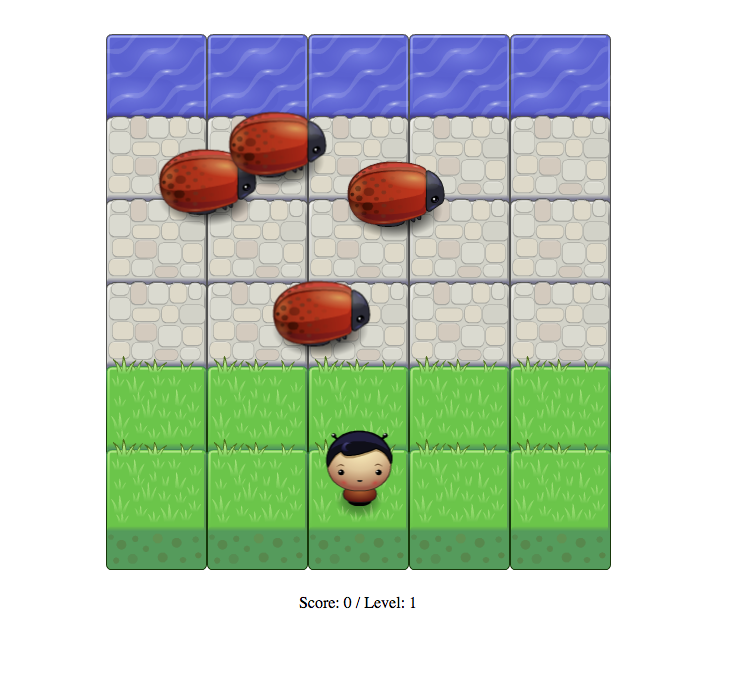

# Bug Arcade Game

A Bug dodging application for fun.

## How to use
You can run locally: 

```
clone repository
$ cd frontend-nanodegree-arcade-game
$ open index.html 
```

## Features

- User can move left, right, up and down
- Bugs move across the screen
- User can increase level and score
- Message displays when user is caught

